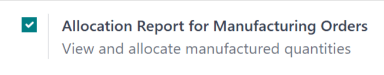
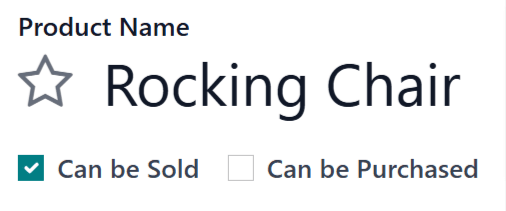

==================
Allocation reports
==================

.. |SO| replace:: :abbr:`SO (sales order)`
.. |SOs| replace:: :abbr:`SOs (sales orders)`
.. |MO| replace:: :abbr:`MO (manufacturing order)`
.. |MOs| replace:: :abbr:`MOs (manufacturing orders)`
.. |RfQ| replace:: :abbr:`RfQ (request for quotation)`

When fulfilling sales orders (SOs), or sourcing components for manufacturing orders (MOs), it is
sometimes necessary to prioritize one |SO| or |MO| over another. In situations where there is
insufficient stock on-hand to fulfill every |SO| or |MO|, this means ensuring that products and
components are reserved for those that must be prioritized.

In Odoo *Manufacturing*, allocation reports are used on |MOs| to assign products to specific sales
orders |SOs|, or components to specific |MOs|. This ensure that the products or components are
available for those orders, and are not used for others by mistake.

Configuration
=============

To use allocation reports, the *Allocation Report for Manufacturing Orders* feature must be enabled.
To do so, navigate to :menuselection:`Manufacturing app --> Configuration --> Settings`, and tick
the checkbox next to :guilabel:`Allocation Report for Manufacturing Orders`.

For products that are sold, it is also necessary to configure them so they can be included in |SOs|.
To do so, begin by navigating to :menuselection:`Inventory --> Products --> Products`, and select a
product. Under the product's name, make sure that the :guilabel:`Can Be Sold` checkbox is enabled.

Allocate products
=================

To allocate products or components from the |MO| in which they were produced to an |SO| or different
|MO|, begin by navigating to :menuselection:`Manufacturing --> Orders --> Manufacturing Orders`.
Click :guilabel:`New` to create a new |MO|.

On the |MO|, select a product in the :guilabel:`Product` field, and specify the quantity to be
produced in the :guilabel:`Quantity` field. Finally, click :guilabel:`Confirm` to confirm the |MO|.

The rest of the allocation workflow depends on the current on-hand quantity of the product being
manufactured, and whether or not there are any |SOs| or |MOs| which require the product, but have
not already been allocated units of it.

If there **ARE** existing |SOs| and |MOs| that require the product, **AND** there are too few units
of the product on-hand to fulfill those orders, then a :icon:`fa-list` :guilabel:`Allocation` smart
button appears at the top of the page as soon as the |MO| is confirmed.

If there **ARE** existing |SOs| and |MOs| that require the product, **AND** there **ARE** enough
units of the product on-hand to fulfill those orders, then the :icon:`fa-list`
:guilabel:`Allocation` smart button only appears at the top of the page once the |MO| has been
marked as done, by clicking :guilabel:`Produce All`.

.. image:: allocation/allocation-button.png
   :align: center
   :alt: The Allocation smart button at the top of an MO.

.. note::
   If there **ARE NOT** any existing |SOs| and |MOs| that require the product, the :icon:`fa-list`
   :guilabel:`Allocation` smart button does not appear, even when the |MO| has been marked as done.

Click the :icon:`fa-list` :guilabel:`Allocation` smart button to open the *MRP Reception Report* for
the |MO|.

If a finished product is manufactured, this page lists any open customer delivery orders for which
quantities of the product have yet to be reserved.

If a manufacturing component is manufactured, this page lists any open |MOs| for which quantities of
the component have yet to be reserved.

Click the :guilabel:`Assign All` button to the right of a specific order to assign products for each
quantity required to fulfill that order. For example, if an order requires one quantity of four
units of the product, and one quantity of one unit of the product, clicking :guilabel:`Assign All`
assigns five units of the product to fulfill both quantities.

Alternatively, click :guilabel:`Assign` next to a specific quantity to only assign products to that
quantity, and not any others in the order. Using the previous example, clicking :guilabel:`Assign`
next to the quantity of one unit assigns a product to that quantity, but leaves the quantity of four
units without any products assigned.

After assigning products to a quantity, the :guilabel:`Assign` button turns into an
:guilabel:`Unassign` button. Click :guilabel:`Unassign` to unreserve the assigned products from that
quantity, making them available for other quantities.

.. image:: allocation/reception-report.png
   :align: center
   :alt: The MRP Reception Report for an MO.

After clicking :guilabel:`Assign All` or :guilabel:`Assign`, the :guilabel:`Print Labels` or
:guilabel:`Print Label` button to the right of it becomes selectable. Selecting either button
generates and downloads a PDF document with one label for each product that was assigned. These
labels are used to designate each product as being reserved for that specific order.

.. image:: allocation/assigned-labels.png
   :align: center
   :alt: The assignment labels generated by clicking Print Labels or Print Label.
